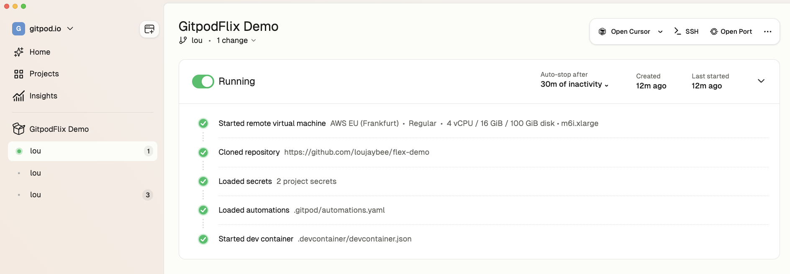
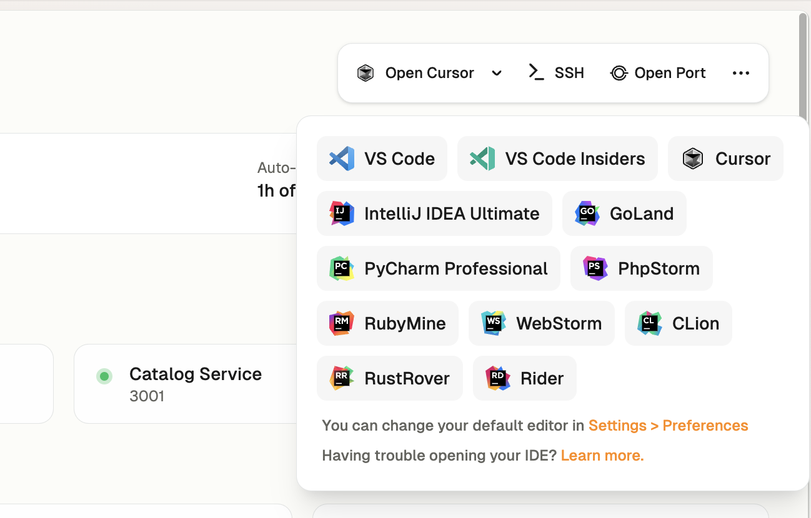
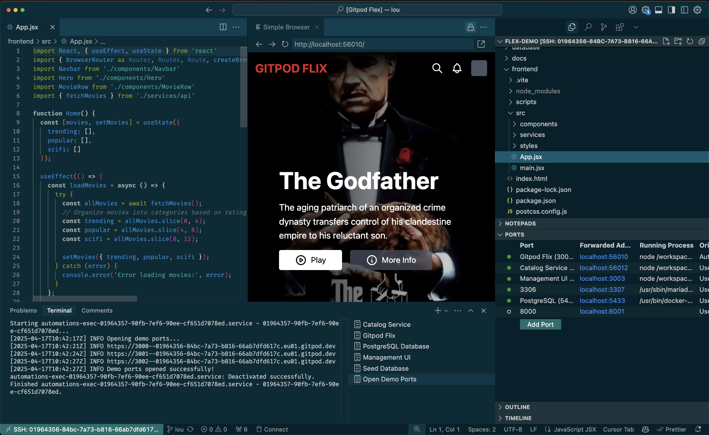

# OnaFlix 🎬

> **⚠️ EXPERIMENTAL PLAYGROUND - This repository resets every night at 2 AM UTC!**  
> Feel free to merge PRs and experiment - all changes are temporary. See [PUBLIC_REPO_NOTICE.md](PUBLIC_REPO_NOTICE.md) for details.

A modern streaming platform demo built for Ona environments, showcasing a full-stack application with React frontend, Node.js backend, and PostgreSQL database.

## Features

- 🎥 Movie catalog with search and filtering
- 🔍 Advanced search with full-text capabilities
- 📱 Responsive design with Tailwind CSS
- 🚀 Fast development with Vite

## Architecture

- **Frontend**: React 18 + TypeScript + Vite + Tailwind CSS (Port 3000)
- **Backend**: Node.js + Express + TypeScript (Port 3001)
- **Database**: PostgreSQL 15 with full-text search (Port 5432)
- **Development**: Hot reload, automated setup, health checks

## Quick Start

### Automatic Startup ✨
The environment automatically starts all services when opened:

1. **Wait for initialization** (30-60 seconds)
2. **Access the application**:
   - **Frontend**: http://localhost:3000
   - **Backend API**: http://localhost:3001
   - **Health Check**: http://localhost:3001/health

### Manual Control 🔧
```bash
# Start all services
./startup.sh

# Check service health
./health-check.sh

# Restart if needed
./startup.sh
```

## Service Status

Check if all services are running:

```bash
./health-check.sh
```

Expected output:
```
🔍 OnaFlix Health Check
==========================
[SUCCESS] PostgreSQL: ✅ Connected (18 movies in database)
[SUCCESS] Backend API: ✅ http://localhost:3001 (Status: OK)
[SUCCESS] Frontend: ✅ http://localhost:3000 (Ona Flix)
[SUCCESS] Movies API: ✅ /api/movies (18 movies)
[SUCCESS] Search API: ✅ /api/search (1 results for 'dark')

📊 Health Check Summary
======================
[SUCCESS] All services are healthy! 🎉
```

## Development

### Project Structure
```
├── frontend/          # React frontend application
├── backend/catalog/   # Node.js API service
├── database/main/     # PostgreSQL setup and migrations
├── .devcontainer/     # Development container configuration
├── .ona/             # Ona automation configuration
├── startup.sh        # 🚀 Service startup script
├── health-check.sh   # 🔍 Health monitoring script
└── README.md         # This file
```

### API Endpoints

- `GET /api/movies` - Get all movies
- `GET /api/search` - Search movies with filters
- `GET /api/suggestions` - Get search suggestions
- `POST /api/movies/seed` - Seed database with sample data
- `GET /health` - Service health check

### Database Schema

The PostgreSQL database includes:
- Full-text search capabilities
- Movie metadata (genres, cast, director, etc.)
- Optimized indexes for search performance
- Sample movie data with complete metadata

## Troubleshooting

### Quick Diagnostics
```bash
# Check all services
./health-check.sh

# Restart all services
./startup.sh
```

### Service Logs
```bash
# Database logs
docker logs main-postgres-1

# Backend logs
tail -f /tmp/catalog.log

# Frontend logs
tail -f /tmp/frontend.log
```

### Manual Service Management
```bash
# Database
cd database/main && docker-compose up -d

# Backend
cd backend/catalog && npm run dev

# Frontend
cd frontend && npm run dev
```

### Common Issues & Solutions

| Issue | Solution |
|-------|----------|
| **Port conflicts** | Services automatically kill existing processes |
| **Database not ready** | Wait 30s, then run `./health-check.sh` |
| **Missing dependencies** | Run `npm install` in respective directories |
| **Environment variables** | Check `.env` file in `backend/catalog/` |
| **Services not starting** | Run `./startup.sh` to restart all |

## Features Demo

### Search Functionality
- Full-text search across titles, descriptions, and directors
- Genre filtering (Action, Drama, Sci-Fi, etc.)
- Year range filtering (1970-2024)
- Rating and duration filters
- Real-time search suggestions

### Movie Catalog
- Responsive grid layout
- Movie posters and metadata
- Sorting by rating, year, and relevance
- Pagination support
- 18 sample movies with complete metadata

### API Features
- RESTful API design
- Advanced PostgreSQL queries with full-text search
- Error handling and validation
- Health monitoring endpoints
- Automatic database seeding

## Development Tools

- **VS Code Extensions**: Pre-configured for TypeScript, React, and PostgreSQL
- **Hot Reload**: Both frontend and backend support hot reloading
- **Database Tools**: SQLTools extension for database management
- **Linting**: ESLint and Prettier configured
- **Git Integration**: GitHub CLI and Git configured
- **Health Monitoring**: Automated service health checks

## Environment Configuration

The development environment includes:
- ✅ Node.js 18+ with npm
- ✅ PostgreSQL 15 client tools
- ✅ Docker for database containerization
- ✅ All necessary VS Code extensions
- ✅ Automated port forwarding (3000, 3001, 5432)
- ✅ Health monitoring and logging
- ✅ Automatic service startup on environment start

## Contributing

1. Make changes to the codebase
2. Test with `./health-check.sh`
3. Services automatically restart on file changes
4. Commit changes with descriptive messages

## License

This project is a demonstration application for Ona environments.
    * And a link for your first GitHub issue
3. **Go to the projects catalog**
    * Find it at: [app.ona.io/projects](https://app.ona.io/projects)
    * Here is every project in OnaFlix that you have access to
5. **Open up OnaFlix**
    * Search "OnaFlix" in the list and click **'Create environment'**

And bingo! Now have your first environment up and running—that was easy.



See above you now have:

1. A personal, isolated, secure, performant development environment
1. All required source code cloned and authenticated with git
1. Any secrets and access credentials installed ready-to-go
1. Your database, microservices and web server running (via "automations")
1. All your dependencies installed from node to sqlite

## Making a code change

Now in the top right you can choose your favorite editor, whether that's IntelliJ, VS Code or even Cursor.



Your environment will automatically connect.



Here you have:

- All the source code in your favorite editor
- Your running web server on `localhost:3000`
- Your running ports for your API, database, etc
- All authenticated with your GitHub account
- A powerful environment secure in your corporate network

> **Tip:** Let's rename "Ona Flix" to our name by updating `frontend/src/components/Navbar.jsx`. <br/> Watch the web server live reload the change.

Now you're officially **ready-to-code**.

### Explore your development environment

Now you're setup why not explore:

1. Running a database clear and seed "automation" from the Ona UI
2. Connecting to your environment with the CLI `ona environment ssh`
3. Adding dotfiles for your personal preferences

## ✨ How does this Ona magic work?

### Dev Container

All of the dependencies are defined in the `devcontainer.json` file. Your platform team has configured a base image with all of your platform tooling ready to go. Any time platform tooling updates the next environment you open will automatically have the latest tooling.

Here's a simplified version of how that looks:

```json
{
  "name": "OnaFlix Dev Environment",
  "image": "mcr.microsoft.com/devcontainers/base:ubuntu",
  "features": {
    "ghcr.io/devcontainers/features/node:1": {},
    "ghcr.io/warrenbuckley/codespace-features/sqlite:1": {}
  },
  "forwardPorts": [
    3000,
    ...
  ],
  "postCreateCommand": ".devcontainer/setup.sh",
  "customizations": {
    "vscode": {
      "extensions": [
        "dbaeumer.vscode-eslint",
        ...
      ]
    }
  }
}
```

This includes:

1. Dependencies like SQLite and Node.JS
2. Configurations of ports to forward
3. A script for additional dependencies and setup
4. Customizations for your editor

### Automations

Your team have configured automations in `.ona/automations.yaml`.

Here's a simplified version of how that looks:

```yaml
services:
  catalog:
    name: "OnaFlix Web Server"
    triggeredBy:
      - postEnvironmentStart
    commands:
      start: |
        cd /workspaces/ona-flix/frontend
        PORT=3001 npx nodemon src/index.ts

tasks:
  seedDatabase:
    name: "Seed Database"
    description: "Seed the database with sample movies in a dramatic sequence"
    triggeredBy:
      - manual
      - postEnvironmentStart
    command: |
      PGPASSWORD=ona psql -h localhost -U ona -d onaflix -f seeds/movies_complete.sql
```

This includes:

- Configurations to start your webservers, databases and microservices
- Automated tasks to seed your database, run tests, etc

All of these are setup to be self-serve and automatically configured. **If anything ever breaks, simply delete your environment and create a new one.**

## FAQs

### Where is my environment running? 

Environments run locally or remotely for different projects with different needs. 

### Can I run multiple environment at once?

Yes. The platform team have set policies to manage cost of remote environments. 

### Can I clone multiple repositories?

Yes.

### Can I customize my environment?

Yes, with dotfiles. 

### Can environments run locally? 

Yes for some projects with lower security requirements—but not for others. 

### What happens if the environment stops?

Your code is saved—simply restart to continue working.

### Can I connect via SSH for Vim, etc?

Yes via the Ona CLI.

### How do I increase my machine size?

Projects are configured with a specific machine size that's perfect to use. 
